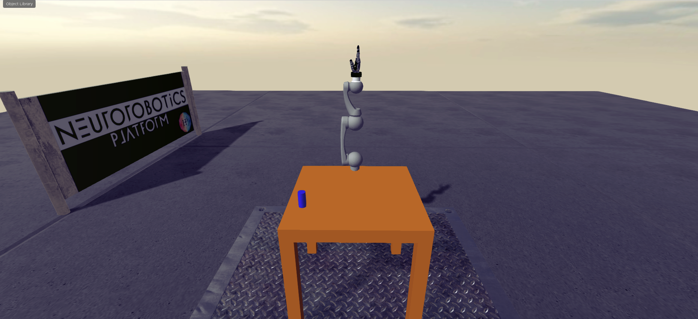

This repository contains files for a Reinforcement Learning Experiment on the Neurorobotics platform
(NRP).

## Installation
First make sure that Docker and docker-compose are installed. Clone the repository and add the path to your .bashrc configuration file:
```
$ export TUM_NRP_DIR=/path/to/repository/
```
This folder will be mapped into the Docker containers. Place your own files here to access them. Adapt the setup scripts for storage and backend to add your own models, ROS packages, etc.

Open a new terminal and proceed with the installation as follows:
* Change to the directory TUM_NRP_DIR with the experiment files
* Make sure your docker0 ip address is 172.17.0.1. If not, enter your address in nrp-docker/run-nrp.yml
* Run the script initialize_volumes.sh in nrp-docker

## Starting and stopping the NRP
First change to TUM_NRP_DIR/nrp-docker. You can then start the NRP with the following command:
```
$ docker-compose -f run-nrp.yml up -d
```
Stop the NRP and remove all containers:
```
$ docker-compose -f run-nrp.yml rm -s -f
```
Enter a backend (by default, the setup starts two backends backend1 and backend2):
```
$ docker-compose -f run-nrp.yml exec backend1 bash
```

To reinstall the NRP you need to remove both the containers and the volumes. Run initialize_volumes.sh again afterwards.

## Accessing the NRP Web Frontend
As soon as the NRP is running, it is accessible from the browser (a Chromium-based browser is recommended for best performance):

http://localhost:9000/#/esv-private?dev

You need to login with nrpuser/password the first time you access the system. Besides the web frontend, there is also a Python library for controlling the NRP:

https://pypi.org/project/pynrp/

To access the NRP Web Frontend via VirtualCoach open a python shell inside the container and import auto_sim:
```
$ cd /tum_nrp/experiment
$ python
>>> import auto_sim
```

Connect to the NRP Web Frontend, launch a cloned experiment and start the simulation:
```
>>> autosim=auto_sim.AutoSim()
>>> autosim.start()
```

Pause the simulation:
```
>>> autosim.pause()
```

Stop the simulation:
```
>>> autosim.stop()
```

## Experiment Setup
The environment consists of one Hollie Robot arm with six Degrees of Freedom, sitting on a table. A Schunk hand is mounted on the arm, but it is of little relevance to the task to be solved. There is also one blue cylinder on the table.



The task is for the arm to move towards the cylinder and knock it off the table. The observations at
each time step are: 
* The current joint positions (six dimensional)
* The current object pose (position and orientation) (seven dimensional)

and the actions to be taken are:
* The six joint positions

A position controller takes care of moving the joints to the desired positions.

## Interacting with the Simulation
After launching the experiment and clicking on the play button, you can interact with the simulation
from a python shell though the Agent class in 'experiment_api.py'. It is better to do this within
the docker container, because you might need to install additional dependencies if you want to run 
it on your system. Below are the steps for interacting with the simulation from within the docker 
container:

1. Clone the CMLR experiment template in the web interface, launch the experiment and start the simulation.

2. Enter the backend with the experiment you want to control as described above.

3. Open a python shell inside the backend container. import the experiment api:
```
$ cd ~
$ python
```
4. Import the experiment api and instantiate the agent class :
```
>>> import experiment_api
>>> exp = experiment_api.Experiment()
```
5. Operate the experiment using the high level function setup and execute:
```
>>> exp.setup()
>>> exp.execute(1, 1, 1, 1, 1, 1)
```
6. Directly controll the cylinder and the robot via acroding the experiment instances:
```
>>> exp.robot.act(1, 1, 1, 1, 1, 1)
>>> exp.cylinder.get_position()
```

## Reinforcement learning models
All our RL models and documentation on how to use them can be found in the [`rlmodel`](https://gitlab.lrz.de/cmlr_ss_21/G2_ReachingTask/-/tree/master/rlmodel) folder.