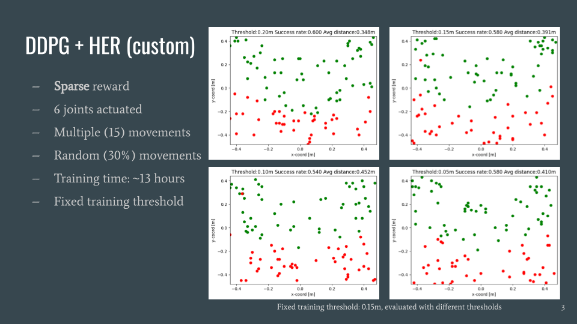
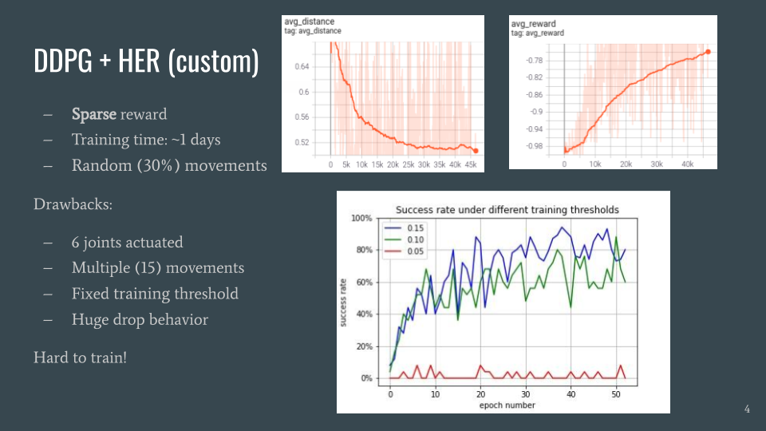

# Custom DDPG Implementation

This is customized implementation of the Deep Deterministic Policy Gradient (DDPG) with Hindsight Experience Replay (HER) Extension on Gym environment.

Contact: Chuanlong Zang (chuanlong.zang@tum.de)

## Structure

[train.ipynb](https://gitlab.lrz.de/cmlr_ss_21/G2_ReachingTask/-/blob/master/rlmodel/ddpg/ddpg%20(no%20sb3)/train.ipynb) is the only file that should be opened while running.

[arguments.py](https://gitlab.lrz.de/cmlr_ss_21/G2_ReachingTask/-/blob/master/rlmodel/ddpg/ddpg%20(no%20sb3)/arguments.py) contains many parameters that can be adjusted accordingly.

[robot_env_truthData.py](https://gitlab.lrz.de/cmlr_ss_21/G2_ReachingTask/-/blob/master/rlmodel/ddpg/ddpg%20(no%20sb3)/robot_env_truthData.py) defines the superclass of environment. The part of reason is that environment could also be connected with utils.EzPickle, which however, didn't be used in the further discussion.

[robot_trueData.py](https://gitlab.lrz.de/cmlr_ss_21/G2_ReachingTask/-/blob/master/rlmodel/ddpg/ddpg%20(no%20sb3)/robot_trueData.py) defines a superclass of [robot_env_truthData.py](https://gitlab.lrz.de/cmlr_ss_21/G2_ReachingTask/-/blob/master/rlmodel/ddpg/ddpg%20(no%20sb3)/robot_env_truthData.py). This file is important, since all the environment are defined in this file, such as observation, reward, step etc. At the beginning of this semester, a simulated cylinder was also used. 

[arguments.py](https://gitlab.lrz.de/cmlr_ss_21/G2_ReachingTask/-/blob/master/rlmodel/ddpg/ddpg%20(no%20sb3)/arguments.py) stores the hyperparameters. This file could be used when comparing the results, and looking for best performance models.

[ddpg_agent.py](https://gitlab.lrz.de/cmlr_ss_21/G2_ReachingTask/-/blob/master/rlmodel/ddpg/ddpg%20(no%20sb3)/ddpg_agent.py) defines the algorithm of ddpg. Some crucial functions are implemented, such as learn, update network etc.

[grpc_rl.py](https://gitlab.lrz.de/cmlr_ss_21/G2_ReachingTask/-/blob/master/rlmodel/ddpg/ddpg%20(no%20sb3)/grpc_rl.py) is a wrapper that connects the algorithm with robot; (using grpc)

[her.py](https://gitlab.lrz.de/cmlr_ss_21/G2_ReachingTask/-/blob/master/rlmodel/ddpg/ddpg%20(no%20sb3)/her.py) implements HER algorithm;

[models.py](https://gitlab.lrz.de/cmlr_ss_21/G2_ReachingTask/-/blob/master/rlmodel/ddpg/ddpg%20(no%20sb3)/models.py) implements MLP layer; The number of input layer is same as dimension of observation, and output of layer is same as action of the agent.

[replay_buffer.py](https://gitlab.lrz.de/cmlr_ss_21/G2_ReachingTask/-/blob/master/rlmodel/ddpg/ddpg%20(no%20sb3)/replay_buffer.py) is a typical buffer that HER uses;

## Run

To use this, you need to use [train.ipynb](https://gitlab.lrz.de/cmlr_ss_21/G2_ReachingTask/-/blob/master/rlmodel/ddpg/ddpg%20(no%20sb3)/train.ipynb) and adjust the parameters in the [arguments.py](https://gitlab.lrz.de/cmlr_ss_21/G2_ReachingTask/-/blob/master/rlmodel/ddpg/ddpg%20(no%20sb3)/arguments.py).

## Result & Further Discussion

As in our project paper said, we got good results when testing the reach task. However, as seen from above images, there are several drawbacks which I tried to improve but failed:

1. Timing issue: A number of hours, even one day will be taken to train the model. Compared to sb3 models. this is relatively too long.

2. Huge performance drop: When applying 0.05 m threshold, the model cannot learn anything. This phenomenon is typical in ddpg algorithm, and it can be improved by TD3 algorithm.

3. Performance: Compared with algorithms in sb3, the final results are not as good as them. So we moved to sb3 later on.

## main References

### Algorithm Part

1. [original DDPG paper](https://arxiv.org/abs/1509.02971v6)
2. [original HER paper](https://arxiv.org/abs/1707.01495)

### Code Part

1. [DDPG from stable baseline 3](https://github.com/DLR-RM/stable-baselines3/tree/master/stable_baselines3/ddpg)

2. [ReAgent](https://github.com/facebookresearch/ReAgent)

3. [ChainerRL and PFRL](https://github.com/chainer/chainerrl)

4. [the original OpenAI's code](https://github.com/openai/baselines/tree/master/baselines/her)